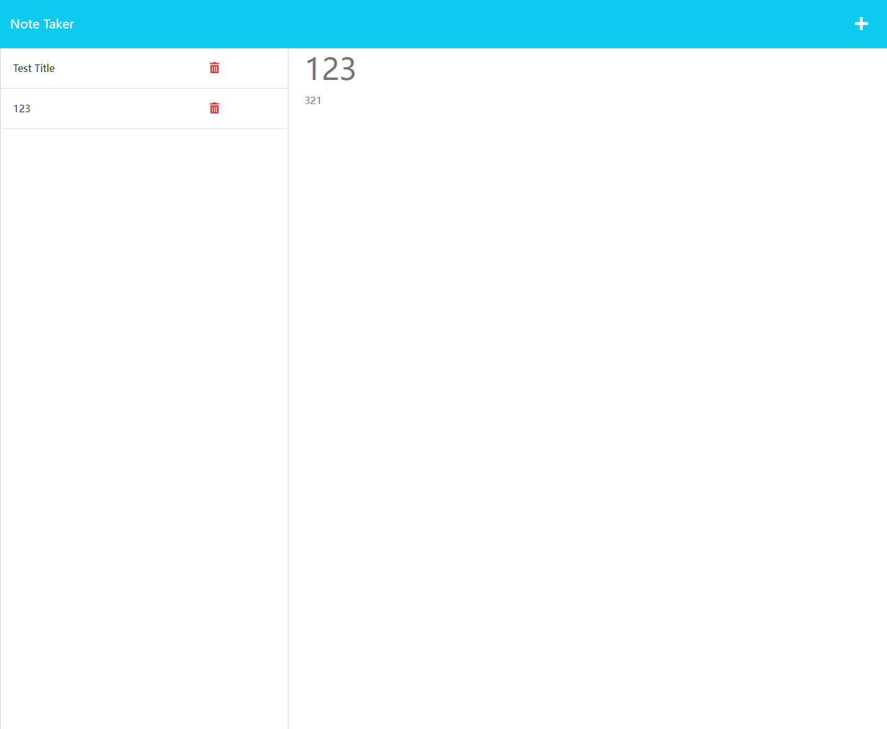

# Notes-Taker

## Description

You can use the application to write notes and save them. You can also delete the particular note.

## Table of Contents

- [Installation](#installation)
- [Usage](#usage)
- [License](#license)
- [Contributing](#contributing)
- [Tests](#tests)
- [Questions](#questions)

## Installation

npm i, npm i express

## Usage

## License

This project is licensed under the [MIT](https://opensource.org/licenses/MIT) license.

## Contributing

contribution guidelines

## Tests

passed

## Questions

For any questions or concerns, please contact me at yinggeberry@gmail.com. You can also visit my [GitHub profile](https://github.com/huyingg1).

Link is here:https://desolate-tundra-57256.herokuapp.com/notes

